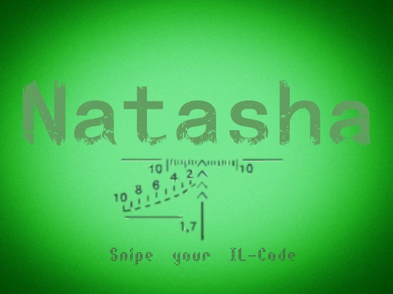

# 项目信息
<table>
    <tr>
      <td align="center" width="200px">项目名称</td>   
      <td align="center" width="200px"><a href="https://github.com/NMSLanX/Mellivora" >Mellivora</a></td>   
      <td rowspan="7"></td>
    </tr>
    <tr>
        <td align="center">项目类别</td>
        <td align="center">.NET(nfx4.5)</td>
    </tr>
    <tr>
        <td align="center">项目版本</td>
        <td align="center">V1.0</td>
    </tr>
     <tr>
        <td align="center">项目作者</td>
        <td align="center">LanX</td>
    </tr>
     <tr>
        <td align="center">项目文档</td>
        <td align="center">LanX</td>
    </tr>
     <tr>
        <td align="center">更新时间</td>
        <td align="center">2017.08.21</td>
    </tr>
    <tr>
        <td align="center">感谢</td>
        <td align="center">Victor.X.Qu</td>
    </tr>
</table>
